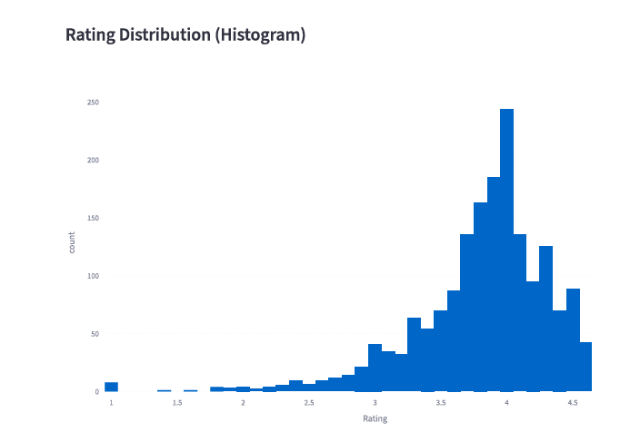
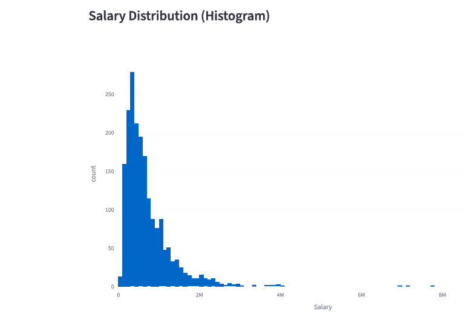
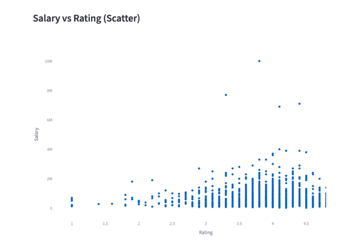
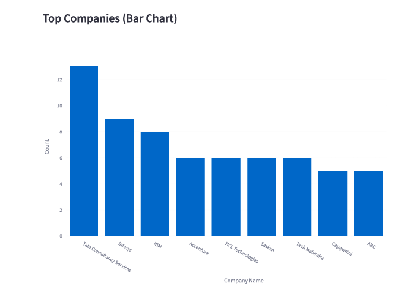
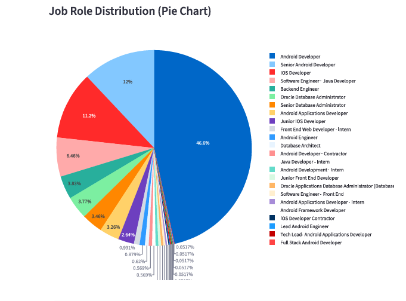
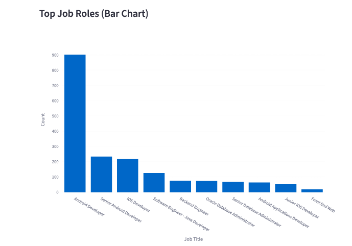
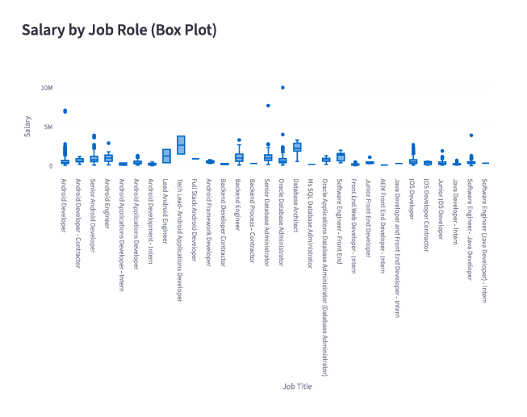

# 💼 Salary Dashboard Project

📌 Project Overview

This project is a Salary Dashboard built using Python.
It analyzes salary data and provides insights using visualization.
---
📂 Project Files

- batch 7 dataset-salary.csv
- keerthiga_CLADS.ipynb
- salary_dashboard_py.py
---
📊 Output Screenshots

🔹 Output 1

🔹 Output 2

🔹 Output 3

🔹 Output 4

🔹 Output 5

🔹 Output 6

🔹 Output 7

---
🚀 How to Run

1. Open the project in VS Code
2. Run the ".ipynb" file or ".py" file
3. View the dashboard output
---
🔗 GitHub Repository

https://github.com/keerthiga524/salary-dashboard

---
✨ Author

Keerthiga Pazhanivel
